<!-- AUTO-GENERATED by grove. Do not edit. Run `grove render` to refresh. -->

# Development dashboard

## Content health

| Measure | Count | Composition |
| --- | --- | --- |
| C (content) | 19 | validated B 1 · answered Q 1 · accepted D 8 · active Discovery 9 |
| V (uncertainty) | 9 | open Q 2 · pending B 4 · W below DoR 2 · uncovered surface 1 |

## Areas

| Area | Title | C (content) | V (uncertainty) | Composition |
| --- | --- | --- | --- | --- |
| A-01 | Evals | 0 | 0 | C: validated B 0 · answered Q 0 · accepted D 0; V: open Q 0 · pending B 0 · W below DoR 0 |
| A-02 | API | 0 | 3 | C: validated B 0 · answered Q 0 · accepted D 0; V: open Q 0 · pending B 0 · W below DoR 2 · uncovered surface 1 |
| A-03 | Rust core | 0 | 0 | C: validated B 0 · answered Q 0 · accepted D 0; V: open Q 0 · pending B 0 · W below DoR 0 |
| A-04 | MCP server | 0 | 0 | C: validated B 0 · answered Q 0 · accepted D 0; V: open Q 0 · pending B 0 · W below DoR 0 |
| A-05 | Desktop | 0 | 0 | C: validated B 0 · answered Q 0 · accepted D 0; V: open Q 0 · pending B 0 · W below DoR 0 |
| A-06 | Release | 0 | 0 | C: validated B 0 · answered Q 0 · accepted D 0; V: open Q 0 · pending B 0 · W below DoR 0 |
| A-07 | Agent integrations | 4 | 0 | C: validated B 0 · answered Q 1 · accepted D 1 · active Discovery 2; V: open Q 0 · pending B 0 · W below DoR 0 |

> Relevance view, not a partition: a node touching two areas counts in both; a W without goals counts in none. The Content health totals above are primary.

## Goals

| ID | Outcome | Fitness function | Status |
| --- | --- | --- | --- |
| G-17 | Scaling and performance budget | count; current= target=2 | unverified |
| G-21 | Graph kind filters keep every node attached | count; current=1 target=1 | verified |
| G-22 | Area surface chips truncate with tooltip | count; current=1 target=1 | verified |
| G-23 | Count badges switch style above ninety-nine | count; current=1 target=1 | verified |
| G-24 | Area card headers wrap ids as units | count; current=1 target=1 | verified |
| G-25 | DeepSeek Harness plugin exposes the Grove CLI as agent tools | count; current=7 target=7 | verified |

## Work items

| ID | Type | Title | Goals | Cynefin | DoR | Status | Critical |
| --- | --- | --- | --- | --- | --- | --- | --- |
| W-04 | feature | Benchmark suite: 10k-node lock, cone, render budgets | G-17 | complicated | ⊥ | proposed | ★ |
| W-05 | refactor | Adjacency-list max-flow and lazy min-fill for treewidth | G-17 | complicated | ⊥ | proposed |  |
| W-100 | bug | Truncate area surface chips with ellipsis tooltip | G-22 | clear | ⊤ | done |  |
| W-101 | bug | Widen count badges for totals above ninety-nine | G-23 | clear | ⊤ | done |  |
| W-102 | bug | Keep area id tokens whole in card headers | G-24 | clear | ⊤ | done |  |
| W-103 | feature | Scaffold the dsh bundle package (package.json, cordis.patch.yml, TS entry) | G-25 | clear | ⊤ | done |  |
| W-104 | feature | Implement read-only Grove tools (status, next, packet, list, show, ready, path) | G-25 | clear | ⊤ | done |  |
| W-105 | feature | Implement mutating Grove tools (add, field, set, evidence, fitness, link) | G-25 | complicated | ⊤ | done |  |
| W-106 | feature | Smoke test the bundle in a live dsh profile and document the setup | G-25 | complicated | ⊤ | done |  |
| W-107 | refactor | Restructure the plugin as packages/dsh on the Bun toolchain | G-25 | complicated | ⊤ | done |  |
| W-108 | refactor | Migrate the plugin tests to bun test | G-25 | clear | ⊤ | done |  |
| W-109 | refactor | Apply project code style (comments, quotes, semicolons, aliases) | G-25 | clear | ⊤ | done |  |
| W-99 | bug | Attach view-orphaned nodes to root in graph filters | G-21 | complicated | ⊤ | done |  |

## Decisions

| ID | Title | Status | Supersedes |
| --- | --- | --- | --- |
| D-05 | Release signing runs in approval-gated GitHub Actions, not on an offline host | accepted |  |
| D-06 | trivy is the supply-chain scanner behind an in-repo policy wrapper | accepted |  |
| D-07 | Rust binaries (grove, grove-mcp) are the primary release artifacts; Julia is a developer source install | accepted |  |
| D-08 | Compliance scoped to non-commercial FOSS; CRA machinery dropped with documented revisit triggers | accepted |  |
| D-09 | Distribution only via GitHub Releases with a signed manifest as the trust anchor | accepted |  |
| D-10 | License changed from MIT to AGPL-3.0-only before the first release | accepted | D-08 |
| D-12 | dsh plugin as a thin CLI wrapper bundle | accepted |  |
| D-13 | Bun toolchain and project code style for the dsh plugin | accepted |  |

## Open questions

| ID | Question | Cynefin | Targets | Status |
| --- | --- | --- | --- | --- |
| Q-03 | Add cosign keyless as an additional, no-stored-key verification path alongside attestations? | complicated |  | open |
| Q-04 | What replaces macos-15-intel for macos_x64 builds when GitHub retires Intel runners (~August 2027)? | complicated |  | open |
| Q-05 | What is the exact ctx.tools.register signature and parameter schema format in dsh 0.1? | complicated | W-103 | answered |

## Assumptions

| ID | Assumption | Tests | Targets | Status |
| --- | --- | --- | --- | --- |
| B-01 | Surprise rate declines as C grows |  |  | testing |
| B-02 | Rework proxies are lower on covered surfaces than uncovered |  |  | testing |
| B-03 | Distill yield stays above noise at archive gates |  |  | testing |
| B-04 | DoR refusals followed by discovery raise first-pass evidence acceptance |  |  | testing |
| B-05 | The dsh plugin runtime permits spawning the grove CLI as a child process |  |  | validated |

## Themes

| ID | Title | Status | Causes work | Themed work |
| --- | --- | --- | --- | --- |
| T-01 | Scaling performance | open | – | W-04, W-05 |
| T-04 | Plugin toolchain restyle | open | W-107, W-108, W-109 | – |

## Discoveries

| ID | Title | Tags | Status |
| --- | --- | --- | --- |
| Y-01 | Normalize at capture, never inject test clocks | normalization | active |
| Y-02 | Never gate a validation task on the hypotheses it validates | causal inversion | active |
| Y-03 | Integration surfaces are thin adapters over the core CLI contract | thin adapter | active |
| Y-04 | Release-distribution plan audit: factual errors and design gaps | pinned origin, verify-then-parse | active |
| Y-05 | G-16 implementation audit: pre-release fixes and desktop artifact gap | verify-then-parse | superseded |
| Y-06 | G-16 follow-up audit: artifact name collision and installer parity bugs | verify-then-parse | superseded |
| Y-07 | MCP tool failures must surface CLI stderr; a bare exit code leaves clients blind | thin adapter | active |
| Y-08 | Keep embedded-asset filenames URL-plain: percent-encoded paths (%5B etc.) against frontendDist assets are decoded inconsistently across webviews, silently breaking @font-face on systems without local font fallbacks | url-plain asset | active |
| Y-09 | A dsh agent runs keyless by overriding the agent-default-model row with a scripted mock provider, so tool plugins can be smoke-tested through the real Loader without API keys | dsh | active |
| Y-10 | A dsh bundle needs dsh.bundle.patch in package.json and a cordis.patch.yml insert row; dsh plugin add forwards to pnpm, which must be installed separately | bundle | active |
| Y-11 | bun install on dsh packages fails on the unpublished peer @deepseek-ai/dsh-type-meta; a package.json overrides entry to a local stub resolves it | dsh | active |

## Dependency graph

```mermaid
graph TD
  G_17["G-17: Scaling and performance budget"]:::goal
  G_21["G-21: Graph kind filters keep every node attached"]:::goal
  G_22["G-22: Area surface chips truncate with tooltip"]:::goal
  G_23["G-23: Count badges switch style above ninety-nine"]:::goal
  G_24["G-24: Area card headers wrap ids as units"]:::goal
  G_25["G-25: DeepSeek Harness plugin exposes the Grove CLI as agent tools"]:::goal
  W_04["W-04: Benchmark suite: 10k-node lock, cone, render budgets"]:::feature,critical
  W_05["W-05: Adjacency-list max-flow and lazy min-fill for treewidth"]:::feature
  W_100["W-100: Truncate area surface chips with ellipsis tooltip"]:::done
  W_101["W-101: Widen count badges for totals above ninety-nine"]:::done
  W_102["W-102: Keep area id tokens whole in card headers"]:::done
  W_103["W-103: Scaffold the dsh bundle package (package.json, cordis.patch.yml, TS entry)"]:::done
  W_104["W-104: Implement read-only Grove tools (status, next, packet, list, show, ready, path)"]:::done
  W_105["W-105: Implement mutating Grove tools (add, field, set, evidence, fitness, link)"]:::done
  W_106["W-106: Smoke test the bundle in a live dsh profile and document the setup"]:::done
  W_107["W-107: Restructure the plugin as packages/dsh on the Bun toolchain"]:::done
  W_108["W-108: Migrate the plugin tests to bun test"]:::done
  W_109["W-109: Apply project code style (comments, quotes, semicolons, aliases)"]:::done
  W_99["W-99: Attach view-orphaned nodes to root in graph filters"]:::done
  D_05["D-05: Release signing runs in approval-gated GitHub Actions, not on an offline host"]:::decision
  D_06["D-06: trivy is the supply-chain scanner behind an in-repo policy wrapper"]:::decision
  D_07["D-07: Rust binaries (grove, grove-mcp) are the primary release artifacts; Julia is a developer source install"]:::decision
  D_08["D-08: Compliance scoped to non-commercial FOSS; CRA machinery dropped with documented revisit triggers"]:::decision
  D_09["D-09: Distribution only via GitHub Releases with a signed manifest as the trust anchor"]:::decision
  D_10["D-10: License changed from MIT to AGPL-3.0-only before the first release"]:::decision
  D_12["D-12: dsh plugin as a thin CLI wrapper bundle"]:::decision
  D_13["D-13: Bun toolchain and project code style for the dsh plugin"]:::decision
  Q_03["Q-03: Add cosign keyless as an additional, no-stored-key verification path alongside attestations?"]:::question
  Q_04["Q-04: What replaces macos-15-intel for macos_x64 builds when GitHub retires Intel runners (~August 2027)?"]:::question
  Q_05["Q-05: What is the exact ctx.tools.register signature and parameter schema format in dsh 0.1?"]:::question
  B_01["B-01: Surprise rate declines as C grows"]:::assumption
  B_02["B-02: Rework proxies are lower on covered surfaces than uncovered"]:::assumption
  B_03["B-03: Distill yield stays above noise at archive gates"]:::assumption
  B_04["B-04: DoR refusals followed by discovery raise first-pass evidence acceptance"]:::assumption
  B_05["B-05: The dsh plugin runtime permits spawning the grove CLI as a child process"]:::assumption
  T_01["T-01: Scaling performance"]:::theme
  T_04["T-04: Plugin toolchain restyle"]:::theme
  Y_01["Y-01: Normalize at capture, never inject test clocks"]:::discovery
  Y_02["Y-02: Never gate a validation task on the hypotheses it validates"]:::discovery
  Y_03["Y-03: Integration surfaces are thin adapters over the core CLI contract"]:::discovery
  Y_04["Y-04: Release-distribution plan audit: factual errors and design gaps"]:::discovery
  Y_05["Y-05: G-16 implementation audit: pre-release fixes and desktop artifact gap"]:::discovery
  Y_06["Y-06: G-16 follow-up audit: artifact name collision and installer parity bugs"]:::discovery
  Y_07["Y-07: MCP tool failures must surface CLI stderr; a bare exit code leaves clients blind"]:::discovery
  Y_08["Y-08: Keep embedded-asset filenames URL-plain: percent-encoded paths (%5B etc.) against frontendDist assets are decoded inconsistently across webviews, silently breaking @font-face on systems without local font fallbacks"]:::discovery
  Y_09["Y-09: A dsh agent runs keyless by overriding the agent-default-model row with a scripted mock provider, so tool plugins can be smoke-tested through the real Loader without API keys"]:::discovery
  Y_10["Y-10: A dsh bundle needs dsh.bundle.patch in package.json and a cordis.patch.yml insert row; dsh plugin add forwards to pnpm, which must be installed separately"]:::discovery
  Y_11["Y-11: bun install on dsh packages fails on the unpublished peer @deepseek-ai/dsh-type-meta; a package.json overrides entry to a local stub resolves it"]:::discovery
  A_01["A-01: Evals"]:::area
  A_02["A-02: API"]:::area
  A_03["A-03: Rust core"]:::area
  A_04["A-04: MCP server"]:::area
  A_05["A-05: Desktop"]:::area
  A_06["A-06: Release"]:::area
  A_07["A-07: Agent integrations"]:::area
  D_10 -->|supersedes| D_08
  Q_01 -->|asks| W_06
  Q_02 -->|asks| W_09
  Q_05 -->|asks| W_103
  T_02 -->|causes| W_17
  T_02 -->|causes| W_85
  T_03 -->|causes| W_85
  T_04 -->|causes| W_107
  T_04 -->|causes| W_108
  T_04 -->|causes| W_109
  W_02 -->|produces| Y_02
  W_03 ==>|blocks| W_06
  W_03 -->|produces| D_11
  W_07 ==>|blocks| W_09
  W_07 -->|implements| D_01
  W_08 ==>|blocks| W_09
  W_08 -->|implements| D_02
  W_09 ==>|blocks| W_10
  W_09 -->|implements| D_03
  W_10 -->|implements| D_04
  W_103 ==>|blocks| W_104
  W_103 ==>|blocks| W_105
  W_103 -->|implements| D_12
  W_104 ==>|blocks| W_106
  W_104 -->|implements| D_12
  W_105 ==>|blocks| W_106
  W_105 -->|implements| D_12
  W_106 -->|implements| D_12
  W_107 ==>|blocks| W_108
  W_108 ==>|blocks| W_109
  W_14 ==>|blocks| W_17
  W_17 ==>|blocks| W_18
  W_17 ==>|blocks| W_19
  W_17 ==>|blocks| W_20
  W_71 ==>|blocks| W_74
  W_71 ==>|blocks| W_78
  W_72 ==>|blocks| W_78
  W_73 ==>|blocks| W_78
  W_75 ==>|blocks| W_78
  W_76 ==>|blocks| W_78
  W_77 ==>|blocks| W_78
  W_78 ==>|blocks| W_79
  W_78 -->|produces| Y_05
  W_79 ==>|blocks| W_80
  W_81 ==>|blocks| W_79
  W_82 ==>|blocks| W_79
  W_83 ==>|blocks| W_79
  W_83 -->|produces| Y_06
  W_84 ==>|blocks| W_79
  W_86 ==>|blocks| W_79
  W_87 ==>|blocks| W_79
  W_97 -->|produces| Y_08
  Y_01 -->|distills| D_01
  Y_03 -->|distills| D_04
  Y_04 -->|distills| Q_01
  Y_07 -->|distills| D_04
  Y_09 -->|distills| Q_05
  Y_10 -->|distills| D_12
  Y_11 -->|distills| D_13
  class W_04 critical
classDef area fill:#5a1e4a,color:#fff
classDef goal fill:#1e3a5f,color:#fff
classDef theme fill:#2a4a3a,color:#fff
classDef decision fill:#5a4a1e,color:#fff
classDef question fill:#5a3a1e,color:#fff
classDef assumption fill:#4a2d5a,color:#fff
classDef spike fill:#3a3a5a,color:#fff
classDef feature fill:#1e4a4a,color:#fff
classDef ready fill:#2d5a27,color:#fff
classDef progress fill:#3a4a6a,color:#fff,stroke:#fff,stroke-width:2px
classDef done fill:#2d5a27,color:#fff,stroke:#fff,stroke-width:2px
classDef rejected fill:#5a5a5a,color:#fff
classDef discovery fill:#1f4e5f,color:#fff
classDef critical stroke:#ff0,stroke-width:3px
```

