<!-- AUTO-GENERATED by grove. Do not edit. Run `grove render` to refresh. -->

# Development dashboard

## Content health

| Measure | Count | Composition |
| --- | --- | --- |
| C (content) | 12 | validated B 0 · answered Q 1 · accepted D 7 · active Discovery 4 |
| V (uncertainty) | 11 | open Q 2 · pending B 4 · W below DoR 3 · uncovered surface 2 |

## Areas

| Area | Title | C (content) | V (uncertainty) | Composition |
| --- | --- | --- | --- | --- |
| A-01 | Evals | 0 | 0 | C: validated B 0 · answered Q 0 · accepted D 0; V: open Q 0 · pending B 0 · W below DoR 0 |
| A-02 | API | 2 | 5 | C: validated B 0 · answered Q 1 · accepted D 0 · active Discovery 1; V: open Q 0 · pending B 0 · W below DoR 3 · uncovered surface 2 |
| A-03 | Rust core | 0 | 0 | C: validated B 0 · answered Q 0 · accepted D 0; V: open Q 0 · pending B 0 · W below DoR 0 |
| A-04 | MCP server | 2 | 0 | C: validated B 0 · answered Q 0 · accepted D 1 · active Discovery 1; V: open Q 0 · pending B 0 · W below DoR 0 |
| A-05 | Desktop | 0 | 0 | C: validated B 0 · answered Q 0 · accepted D 0; V: open Q 0 · pending B 0 · W below DoR 0 |
| A-06 | Release | 0 | 0 | C: validated B 0 · answered Q 0 · accepted D 0; V: open Q 0 · pending B 0 · W below DoR 0 |

> Relevance view, not a partition: a node touching two areas counts in both; a W without goals counts in none. The Content health totals above are primary.

## Goals

| ID | Outcome | Fitness function | Status |
| --- | --- | --- | --- |
| G-02 | Programmatic API with CLI parity and perf budget | count; current= target=2 | unverified |
| G-04 | Agent discovery-to-delivery loop via MCP only | boolean; current=true | verified |

## Work items

| ID | Type | Title | Goals | Cynefin | DoR | Status | Critical |
| --- | --- | --- | --- | --- | --- | --- | --- |
| W-03 | refactor | Extract Grove.API structured layer; CLI as thin renderer | G-02 | complex | ⊥ | proposed | ★ |
| W-04 | feature | Benchmark suite: 10k-node lock, cone, render budgets | G-02 | complicated | ⊥ | proposed |  |
| W-05 | refactor | Adjacency-list max-flow and lazy min-fill for treewidth | G-02 | complicated | ⊥ | proposed |  |
| W-06 | feature | grove serve: JSON-lines over stdio and localhost TCP | G-02 | complicated | ⊥ | rejected |  |
| W-10 | feature | MCP server over grove-core: stdio JSON-RPC, tools 1:1 to CLI | G-04 | complicated | ⊤ | done |  |
| W-11 | feature | Validate MCP against real clients | G-04 | clear | ⊤ | progress |  |

## Decisions

| ID | Title | Status | Supersedes |
| --- | --- | --- | --- |
| D-04 | grove-mcp: NDJSON stdio, tools 1:1 to commands, CLI exit codes as tool content | accepted |  |
| D-05 | Release signing runs in approval-gated GitHub Actions, not on an offline host | accepted |  |
| D-06 | trivy is the supply-chain scanner behind an in-repo policy wrapper | accepted |  |
| D-07 | Rust binaries (grove, grove-mcp) are the primary release artifacts; Julia is a developer source install | accepted |  |
| D-08 | Compliance scoped to non-commercial FOSS; CRA machinery dropped with documented revisit triggers | accepted |  |
| D-09 | Distribution only via GitHub Releases with a signed manifest as the trust anchor | accepted |  |
| D-10 | License changed from MIT to AGPL-3.0-only before the first release | accepted | D-08 |

## Open questions

| ID | Question | Cynefin | Targets | Status |
| --- | --- | --- | --- | --- |
| Q-01 | Is the Julia server still needed if the Rust track lands? | complicated | W-06 | answered |
| Q-03 | Add cosign keyless as an additional, no-stored-key verification path alongside attestations? | complicated |  | open |
| Q-04 | What replaces macos-15-intel for macos_x64 builds when GitHub retires Intel runners (~August 2027)? | complicated |  | open |

## Assumptions

| ID | Assumption | Tests | Targets | Status |
| --- | --- | --- | --- | --- |
| B-01 | Surprise rate declines as C grows |  |  | testing |
| B-02 | Rework proxies are lower on covered surfaces than uncovered |  |  | testing |
| B-03 | Distill yield stays above noise at archive gates |  |  | testing |
| B-04 | DoR refusals followed by discovery raise first-pass evidence acceptance |  |  | testing |

## Themes

| ID | Title | Status | Causes work | Themed work |
| --- | --- | --- | --- | --- |
| T-01 | Scaling performance | open | – | W-04, W-05 |

## Discoveries

| ID | Title | Tags | Status |
| --- | --- | --- | --- |
| Y-01 | Normalize at capture, never inject test clocks | normalization | active |
| Y-02 | Never gate a validation task on the hypotheses it validates | causal inversion | active |
| Y-03 | Integration surfaces are thin adapters over the core CLI contract | thin adapter | active |
| Y-04 | Release-distribution plan audit: factual errors and design gaps | pinned origin, verify-then-parse | active |
| Y-05 | G-16 implementation audit: pre-release fixes and desktop artifact gap | verify-then-parse | superseded |
| Y-06 | G-16 follow-up audit: artifact name collision and installer parity bugs | verify-then-parse | superseded |

## Dependency graph

```mermaid
graph TD
  G_02["G-02: Programmatic API with CLI parity and perf budget"]:::goal
  G_04["G-04: Agent discovery-to-delivery loop via MCP only"]:::goal
  W_03["W-03: Extract Grove.API structured layer; CLI as thin renderer"]:::feature,critical
  W_04["W-04: Benchmark suite: 10k-node lock, cone, render budgets"]:::feature
  W_05["W-05: Adjacency-list max-flow and lazy min-fill for treewidth"]:::feature
  W_06["W-06: grove serve: JSON-lines over stdio and localhost TCP"]:::rejected
  W_10["W-10: MCP server over grove-core: stdio JSON-RPC, tools 1:1 to CLI"]:::done
  W_11["W-11: Validate MCP against real clients"]:::progress
  D_04["D-04: grove-mcp: NDJSON stdio, tools 1:1 to commands, CLI exit codes as tool content"]:::decision
  D_05["D-05: Release signing runs in approval-gated GitHub Actions, not on an offline host"]:::decision
  D_06["D-06: trivy is the supply-chain scanner behind an in-repo policy wrapper"]:::decision
  D_07["D-07: Rust binaries (grove, grove-mcp) are the primary release artifacts; Julia is a developer source install"]:::decision
  D_08["D-08: Compliance scoped to non-commercial FOSS; CRA machinery dropped with documented revisit triggers"]:::decision
  D_09["D-09: Distribution only via GitHub Releases with a signed manifest as the trust anchor"]:::decision
  D_10["D-10: License changed from MIT to AGPL-3.0-only before the first release"]:::decision
  Q_01["Q-01: Is the Julia server still needed if the Rust track lands?"]:::question
  Q_03["Q-03: Add cosign keyless as an additional, no-stored-key verification path alongside attestations?"]:::question
  Q_04["Q-04: What replaces macos-15-intel for macos_x64 builds when GitHub retires Intel runners (~August 2027)?"]:::question
  B_01["B-01: Surprise rate declines as C grows"]:::assumption
  B_02["B-02: Rework proxies are lower on covered surfaces than uncovered"]:::assumption
  B_03["B-03: Distill yield stays above noise at archive gates"]:::assumption
  B_04["B-04: DoR refusals followed by discovery raise first-pass evidence acceptance"]:::assumption
  T_01["T-01: Scaling performance"]:::theme
  Y_01["Y-01: Normalize at capture, never inject test clocks"]:::discovery
  Y_02["Y-02: Never gate a validation task on the hypotheses it validates"]:::discovery
  Y_03["Y-03: Integration surfaces are thin adapters over the core CLI contract"]:::discovery
  Y_04["Y-04: Release-distribution plan audit: factual errors and design gaps"]:::discovery
  Y_05["Y-05: G-16 implementation audit: pre-release fixes and desktop artifact gap"]:::discovery
  Y_06["Y-06: G-16 follow-up audit: artifact name collision and installer parity bugs"]:::discovery
  A_01["A-01: Evals"]:::area
  A_02["A-02: API"]:::area
  A_03["A-03: Rust core"]:::area
  A_04["A-04: MCP server"]:::area
  A_05["A-05: Desktop"]:::area
  A_06["A-06: Release"]:::area
  D_10 -->|supersedes| D_08
  Q_01 -->|asks| W_06
  Q_02 -->|asks| W_09
  T_02 -->|causes| W_17
  T_02 -->|causes| W_85
  T_03 -->|causes| W_85
  W_02 -->|produces| Y_02
  W_03 ==>|blocks| W_06
  W_07 ==>|blocks| W_09
  W_07 -->|implements| D_01
  W_08 ==>|blocks| W_09
  W_08 -->|implements| D_02
  W_09 ==>|blocks| W_10
  W_09 -->|implements| D_03
  W_10 -->|implements| D_04
  W_14 ==>|blocks| W_17
  W_17 ==>|blocks| W_18
  W_17 ==>|blocks| W_19
  W_17 ==>|blocks| W_20
  W_71 ==>|blocks| W_74
  W_71 ==>|blocks| W_78
  W_72 ==>|blocks| W_78
  W_73 ==>|blocks| W_78
  W_75 ==>|blocks| W_78
  W_76 ==>|blocks| W_78
  W_77 ==>|blocks| W_78
  W_78 ==>|blocks| W_79
  W_78 -->|produces| Y_05
  W_79 ==>|blocks| W_80
  W_81 ==>|blocks| W_79
  W_82 ==>|blocks| W_79
  W_83 ==>|blocks| W_79
  W_83 -->|produces| Y_06
  W_84 ==>|blocks| W_79
  W_86 ==>|blocks| W_79
  W_87 ==>|blocks| W_79
  Y_01 -->|distills| D_01
  Y_03 -->|distills| D_04
  Y_04 -->|distills| Q_01
  class W_03 critical
classDef area fill:#5a1e4a,color:#fff
classDef goal fill:#1e3a5f,color:#fff
classDef theme fill:#2a4a3a,color:#fff
classDef decision fill:#5a4a1e,color:#fff
classDef question fill:#5a3a1e,color:#fff
classDef assumption fill:#4a2d5a,color:#fff
classDef spike fill:#3a3a5a,color:#fff
classDef feature fill:#1e4a4a,color:#fff
classDef ready fill:#2d5a27,color:#fff
classDef progress fill:#3a4a6a,color:#fff,stroke:#fff,stroke-width:2px
classDef done fill:#2d5a27,color:#fff,stroke:#fff,stroke-width:2px
classDef rejected fill:#5a5a5a,color:#fff
classDef discovery fill:#1f4e5f,color:#fff
classDef critical stroke:#ff0,stroke-width:3px
```

