<!-- AUTO-GENERATED by grove. Do not edit. Run `grove render` to refresh. -->

# Development dashboard

## Content health

| Measure | Count | Composition |
| --- | --- | --- |
| C (content) | 13 | validated B 0 · answered Q 1 · accepted D 6 · active Discovery 6 |
| V (uncertainty) | 11 | open Q 2 · pending B 4 · W below DoR 3 · uncovered surface 2 |

## Areas

| Area | Title | C (content) | V (uncertainty) | Composition |
| --- | --- | --- | --- | --- |
| A-01 | Evals | 0 | 0 | C: validated B 0 · answered Q 0 · accepted D 0; V: open Q 0 · pending B 0 · W below DoR 0 |
| A-02 | API | 2 | 5 | C: validated B 0 · answered Q 1 · accepted D 0 · active Discovery 1; V: open Q 0 · pending B 0 · W below DoR 3 · uncovered surface 2 |
| A-03 | Rust core | 0 | 0 | C: validated B 0 · answered Q 0 · accepted D 0; V: open Q 0 · pending B 0 · W below DoR 0 |
| A-04 | MCP server | 2 | 0 | C: validated B 0 · answered Q 0 · accepted D 1 · active Discovery 1; V: open Q 0 · pending B 0 · W below DoR 0 |
| A-05 | Desktop | 0 | 0 | C: validated B 0 · answered Q 0 · accepted D 0; V: open Q 0 · pending B 0 · W below DoR 0 |
| A-06 | Release | 2 | 0 | C: validated B 0 · answered Q 0 · accepted D 0 · active Discovery 2; V: open Q 0 · pending B 0 · W below DoR 0 |

> Relevance view, not a partition: a node touching two areas counts in both; a W without goals counts in none. The Content health totals above are primary.

## Goals

| ID | Outcome | Fitness function | Status |
| --- | --- | --- | --- |
| G-02 | Programmatic API with CLI parity and perf budget | count; current= target=2 | unverified |
| G-04 | Agent discovery-to-delivery loop via MCP only | boolean; current=true | verified |
| G-16 | Release distribution and signing: binary artifacts, signed manifest, installer, CI | count; current=16 target=19 | partial |

## Work items

| ID | Type | Title | Goals | Cynefin | DoR | Status | Critical |
| --- | --- | --- | --- | --- | --- | --- | --- |
| W-03 | refactor | Extract Grove.API structured layer; CLI as thin renderer | G-02 | complex | ⊥ | proposed |  |
| W-04 | feature | Benchmark suite: 10k-node lock, cone, render budgets | G-02 | complicated | ⊥ | proposed |  |
| W-05 | refactor | Adjacency-list max-flow and lazy min-fill for treewidth | G-02 | complicated | ⊥ | proposed |  |
| W-06 | feature | grove serve: JSON-lines over stdio and localhost TCP | G-02 | complicated | ⊥ | rejected |  |
| W-10 | feature | MCP server over grove-core: stdio JSON-RPC, tools 1:1 to CLI | G-04 | complicated | ⊤ | done |  |
| W-11 | feature | Validate MCP against real clients | G-04 | clear | ⊤ | progress |  |
| W-70 | feature | Phase 0: docs restructure (plans/architecture/security trees) + SECURITY.md | G-16 | complicated | ⊤ | done |  |
| W-71 | feature | bin/sign.sh + bin/verify.sh with test vectors (LibreSSL interop resolved) | G-16 | complicated | ⊤ | done |  |
| W-72 | feature | Key-generation runbook written, then executed; public key committed, secret in release env | G-16 | complicated | ⊤ | done |  |
| W-73 | feature | bin/manifest.sh generating the stable flat manifest with golden tests | G-16 | complicated | ⊤ | done |  |
| W-74 | feature | install.sh bootstrap + tests/install matrix suite + README install rewrite | G-16 | complicated | ⊤ | done |  |
| W-75 | feature | GitHub hardening settings + coverage.yml SHA-pins + Rust/desktop PR CI | G-16 | complicated | ⊤ | done |  |
| W-76 | feature | bin/audit.sh (trivy wrapper, VEX-aware) + security-scan.yml (PR, weekly, dispatch) | G-16 | complicated | ⊤ | done |  |
| W-77 | feature | bin/sbom.sh + vex.json schema/validation + vendored JS provenance (drop unused rx/htmx) | G-16 | complicated | ⊤ | done |  |
| W-78 | feature | release.yml: matrix build, audit gate, approval-gated sign-and-publish, dist/ commit-back, attestations, smoke | G-16 | complicated | ⊤ | done |  |
| W-79 | feature | Dry-run release end-to-end, then v0.1.0 dress rehearsal; gaps recorded in runbooks | G-16 | complicated | ⊤ | ready | ★ |
| W-80 | feature | Phase 4: CONTRIBUTING dep policy, runbook set, architecture + policy docs | G-16 | complicated | ⊤ | ready | ★ |
| W-81 | feature | install.ps1: PowerShell installer for Windows with trust-chain parity to install.sh | G-16 | complicated | ⊤ | done |  |
| W-82 | feature | Pre-release hardening: input validation, tag-pinned build, audit UNKNOWN tier, smoke test, workflow nits | G-16 | complicated | ⊤ | done |  |
| W-83 | feature | Desktop release artifacts: tauri bundles in the matrix, installers install grove-desktop, desktop SBOM coverage | G-16 | complicated | ⊤ | done |  |
| W-84 | feature | Plan text sync: PowerShell constraint, per-component keys, rx.js retention, desktop scope | G-16 | complicated | ⊤ | done |  |
| W-85 | refactor | Unify desktop component naming to grove-desktop across installers, manifest keys, and build outputs | G-16 | clear | ⊤ | done |  |
| W-86 | feature | Post-audit fixes: artifact name collision, desktop chmod, VEX exact match, pip pin, notes heredoc | G-16 | complicated | ⊤ | done |  |
| W-87 | feature | Skill bundle: generated single-file grove-skill.md as a signed release artifact | G-16 | complicated | ⊤ | done |  |
| W-88 | feature | grove://skill primer resource in grove-mcp (compact protocol text embedded in the server) | G-16 | complicated | ⊤ | done |  |

## Decisions

| ID | Title | Status | Supersedes |
| --- | --- | --- | --- |
| D-04 | grove-mcp: NDJSON stdio, tools 1:1 to commands, CLI exit codes as tool content | accepted |  |
| D-05 | Release signing runs in approval-gated GitHub Actions, not on an offline host | accepted |  |
| D-06 | trivy is the supply-chain scanner behind an in-repo policy wrapper | accepted |  |
| D-07 | Rust binaries (grove, grove-mcp) are the primary release artifacts; Julia is a developer source install | accepted |  |
| D-08 | Compliance scoped to non-commercial FOSS; CRA machinery dropped with documented revisit triggers | accepted |  |
| D-09 | Distribution only via GitHub Releases with a signed manifest as the trust anchor | accepted |  |

## Open questions

| ID | Question | Cynefin | Targets | Status |
| --- | --- | --- | --- | --- |
| Q-01 | Is the Julia server still needed if the Rust track lands? | complicated | W-06 | answered |
| Q-03 | Add cosign keyless as an additional, no-stored-key verification path alongside attestations? | complicated |  | open |
| Q-04 | What replaces macos-15-intel for macos_x64 builds when GitHub retires Intel runners (~August 2027)? | complicated |  | open |

## Assumptions

| ID | Assumption | Tests | Targets | Status |
| --- | --- | --- | --- | --- |
| B-01 | Surprise rate declines as C grows |  |  | testing |
| B-02 | Rework proxies are lower on covered surfaces than uncovered |  |  | testing |
| B-03 | Distill yield stays above noise at archive gates |  |  | testing |
| B-04 | DoR refusals followed by discovery raise first-pass evidence acceptance |  |  | testing |

## Themes

| ID | Title | Status | Causes work | Themed work |
| --- | --- | --- | --- | --- |
| T-01 | Scaling performance | open | – | W-04, W-05 |
| T-03 | Release distribution pipeline | open | W-85 | – |

## Discoveries

| ID | Title | Tags | Status |
| --- | --- | --- | --- |
| Y-01 | Normalize at capture, never inject test clocks | normalization | active |
| Y-02 | Never gate a validation task on the hypotheses it validates | causal inversion | active |
| Y-03 | Integration surfaces are thin adapters over the core CLI contract | thin adapter | active |
| Y-04 | Release-distribution plan audit: factual errors and design gaps | pinned origin, verify-then-parse | active |
| Y-05 | G-16 implementation audit: pre-release fixes and desktop artifact gap | verify-then-parse | active |
| Y-06 | G-16 follow-up audit: artifact name collision and installer parity bugs | verify-then-parse | active |

## Dependency graph

```mermaid
graph TD
  G_02["G-02: Programmatic API with CLI parity and perf budget"]:::goal
  G_04["G-04: Agent discovery-to-delivery loop via MCP only"]:::goal
  G_16["G-16: Release distribution and signing: binary artifacts, signed manifest, installer, CI"]:::goal
  W_03["W-03: Extract Grove.API structured layer; CLI as thin renderer"]:::feature
  W_04["W-04: Benchmark suite: 10k-node lock, cone, render budgets"]:::feature
  W_05["W-05: Adjacency-list max-flow and lazy min-fill for treewidth"]:::feature
  W_06["W-06: grove serve: JSON-lines over stdio and localhost TCP"]:::rejected
  W_10["W-10: MCP server over grove-core: stdio JSON-RPC, tools 1:1 to CLI"]:::done
  W_11["W-11: Validate MCP against real clients"]:::progress
  W_70["W-70: Phase 0: docs restructure (plans/architecture/security trees) + SECURITY.md"]:::done
  W_71["W-71: bin/sign.sh + bin/verify.sh with test vectors (LibreSSL interop resolved)"]:::done
  W_72["W-72: Key-generation runbook written, then executed; public key committed, secret in release env"]:::done
  W_73["W-73: bin/manifest.sh generating the stable flat manifest with golden tests"]:::done
  W_74["W-74: install.sh bootstrap + tests/install matrix suite + README install rewrite"]:::done
  W_75["W-75: GitHub hardening settings + coverage.yml SHA-pins + Rust/desktop PR CI"]:::done
  W_76["W-76: bin/audit.sh (trivy wrapper, VEX-aware) + security-scan.yml (PR, weekly, dispatch)"]:::done
  W_77["W-77: bin/sbom.sh + vex.json schema/validation + vendored JS provenance (drop unused rx/htmx)"]:::done
  W_78["W-78: release.yml: matrix build, audit gate, approval-gated sign-and-publish, dist/ commit-back, attestations, smoke"]:::done
  W_79["W-79: Dry-run release end-to-end, then v0.1.0 dress rehearsal; gaps recorded in runbooks"]:::ready,critical
  W_80["W-80: Phase 4: CONTRIBUTING dep policy, runbook set, architecture + policy docs"]:::ready,critical
  W_81["W-81: install.ps1: PowerShell installer for Windows with trust-chain parity to install.sh"]:::done
  W_82["W-82: Pre-release hardening: input validation, tag-pinned build, audit UNKNOWN tier, smoke test, workflow nits"]:::done
  W_83["W-83: Desktop release artifacts: tauri bundles in the matrix, installers install grove-desktop, desktop SBOM coverage"]:::done
  W_84["W-84: Plan text sync: PowerShell constraint, per-component keys, rx.js retention, desktop scope"]:::done
  W_85["W-85: Unify desktop component naming to grove-desktop across installers, manifest keys, and build outputs"]:::done
  W_86["W-86: Post-audit fixes: artifact name collision, desktop chmod, VEX exact match, pip pin, notes heredoc"]:::done
  W_87["W-87: Skill bundle: generated single-file grove-skill.md as a signed release artifact"]:::done
  W_88["W-88: grove://skill primer resource in grove-mcp (compact protocol text embedded in the server)"]:::done
  D_04["D-04: grove-mcp: NDJSON stdio, tools 1:1 to commands, CLI exit codes as tool content"]:::decision
  D_05["D-05: Release signing runs in approval-gated GitHub Actions, not on an offline host"]:::decision
  D_06["D-06: trivy is the supply-chain scanner behind an in-repo policy wrapper"]:::decision
  D_07["D-07: Rust binaries (grove, grove-mcp) are the primary release artifacts; Julia is a developer source install"]:::decision
  D_08["D-08: Compliance scoped to non-commercial FOSS; CRA machinery dropped with documented revisit triggers"]:::decision
  D_09["D-09: Distribution only via GitHub Releases with a signed manifest as the trust anchor"]:::decision
  Q_01["Q-01: Is the Julia server still needed if the Rust track lands?"]:::question
  Q_03["Q-03: Add cosign keyless as an additional, no-stored-key verification path alongside attestations?"]:::question
  Q_04["Q-04: What replaces macos-15-intel for macos_x64 builds when GitHub retires Intel runners (~August 2027)?"]:::question
  B_01["B-01: Surprise rate declines as C grows"]:::assumption
  B_02["B-02: Rework proxies are lower on covered surfaces than uncovered"]:::assumption
  B_03["B-03: Distill yield stays above noise at archive gates"]:::assumption
  B_04["B-04: DoR refusals followed by discovery raise first-pass evidence acceptance"]:::assumption
  T_01["T-01: Scaling performance"]:::theme
  T_03["T-03: Release distribution pipeline"]:::theme
  Y_01["Y-01: Normalize at capture, never inject test clocks"]:::discovery
  Y_02["Y-02: Never gate a validation task on the hypotheses it validates"]:::discovery
  Y_03["Y-03: Integration surfaces are thin adapters over the core CLI contract"]:::discovery
  Y_04["Y-04: Release-distribution plan audit: factual errors and design gaps"]:::discovery
  Y_05["Y-05: G-16 implementation audit: pre-release fixes and desktop artifact gap"]:::discovery
  Y_06["Y-06: G-16 follow-up audit: artifact name collision and installer parity bugs"]:::discovery
  A_01["A-01: Evals"]:::area
  A_02["A-02: API"]:::area
  A_03["A-03: Rust core"]:::area
  A_04["A-04: MCP server"]:::area
  A_05["A-05: Desktop"]:::area
  A_06["A-06: Release"]:::area
  Q_01 -->|asks| W_06
  Q_02 -->|asks| W_09
  T_02 -->|causes| W_17
  T_02 -->|causes| W_85
  T_03 -->|causes| W_85
  W_02 -->|produces| Y_02
  W_03 ==>|blocks| W_06
  W_07 ==>|blocks| W_09
  W_07 -->|implements| D_01
  W_08 ==>|blocks| W_09
  W_08 -->|implements| D_02
  W_09 ==>|blocks| W_10
  W_09 -->|implements| D_03
  W_10 -->|implements| D_04
  W_14 ==>|blocks| W_17
  W_17 ==>|blocks| W_18
  W_17 ==>|blocks| W_19
  W_17 ==>|blocks| W_20
  W_71 ==>|blocks| W_74
  W_71 ==>|blocks| W_78
  W_72 ==>|blocks| W_78
  W_73 ==>|blocks| W_78
  W_75 ==>|blocks| W_78
  W_76 ==>|blocks| W_78
  W_77 ==>|blocks| W_78
  W_78 ==>|blocks| W_79
  W_78 -->|produces| Y_05
  W_79 ==>|blocks| W_80
  W_81 ==>|blocks| W_79
  W_82 ==>|blocks| W_79
  W_83 ==>|blocks| W_79
  W_83 -->|produces| Y_06
  W_84 ==>|blocks| W_79
  W_86 ==>|blocks| W_79
  W_87 ==>|blocks| W_79
  Y_01 -->|distills| D_01
  Y_03 -->|distills| D_04
  Y_04 -->|distills| Q_01
  class W_79,W_80 critical
classDef area fill:#5a1e4a,color:#fff
classDef goal fill:#1e3a5f,color:#fff
classDef theme fill:#2a4a3a,color:#fff
classDef decision fill:#5a4a1e,color:#fff
classDef question fill:#5a3a1e,color:#fff
classDef assumption fill:#4a2d5a,color:#fff
classDef spike fill:#3a3a5a,color:#fff
classDef feature fill:#1e4a4a,color:#fff
classDef ready fill:#2d5a27,color:#fff
classDef progress fill:#3a4a6a,color:#fff,stroke:#fff,stroke-width:2px
classDef done fill:#2d5a27,color:#fff,stroke:#fff,stroke-width:2px
classDef rejected fill:#5a5a5a,color:#fff
classDef discovery fill:#1f4e5f,color:#fff
classDef critical stroke:#ff0,stroke-width:3px
```

