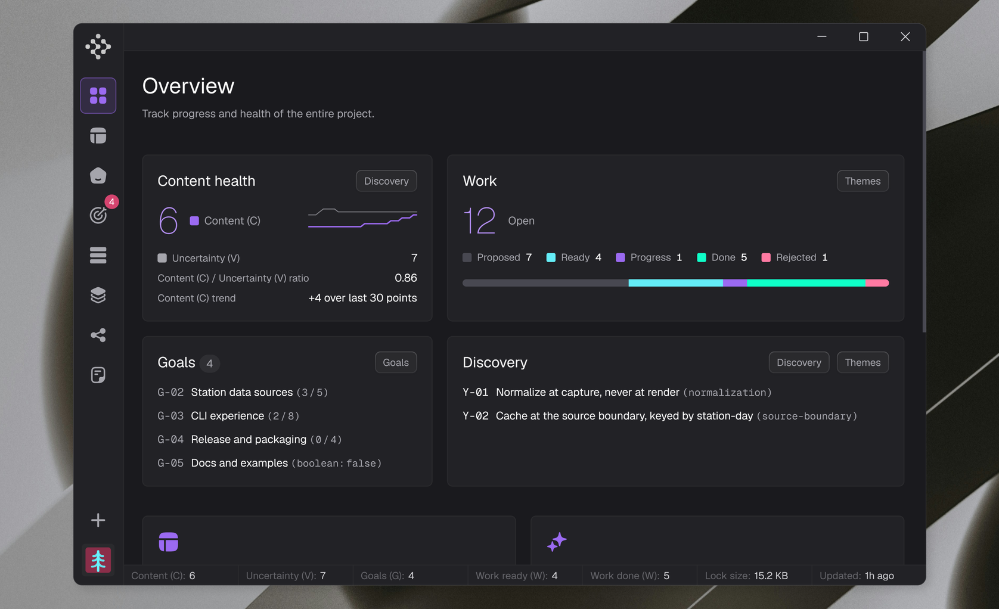
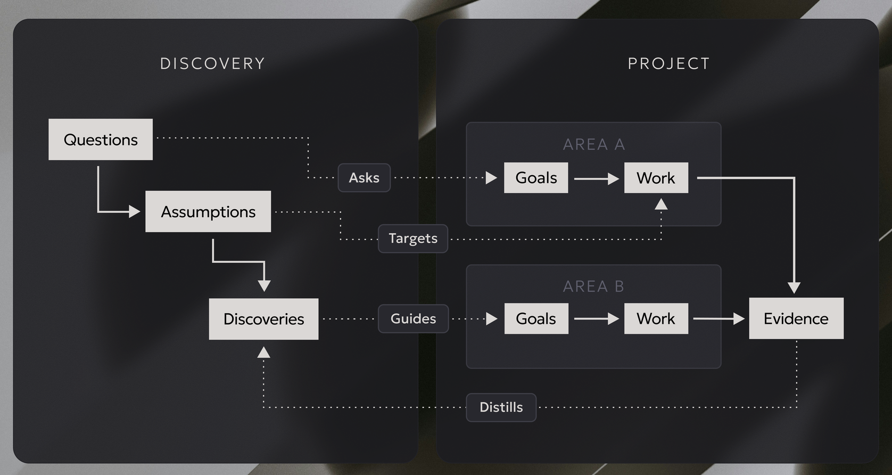

<p align="center">
  <picture>
    <source type="image/webp" srcset=".github/assets/hero.webp" />
    
  </picture>
</p>

***G**raph-driven **R**easoning **O**ver **V**erified **E**vidence. A formal workflow protocol for AI coding agents: deterministic Definition of Ready, falsifiable assumption gates, atomic done-transitions; state lives in a single line-oriented lock file; the agent reads only what the current step demands. Designed to keep deep, long-running projects coherent across sessions, agents, and months.*

<p align="center">
  <a href="https://notebook.google.com/notebook/434f3efc-c199-4b7e-ac61-92fbd85d655e"></a>
  <a href="docs/install.md#verify-before-you-run"></a>
  <a href="LICENSE"></a>
  <a href="https://github.com/alxshelepenok/grove/actions/workflows/rust-tests.yml"></a>
  <a href="packages/grove/conformance"></a>
</p>

**Build products with AI agents without losing control.**

Grove turns your product into a hierarchy (areas, goals, tasks) kept in a living project memory the agent must follow: decisions with their reasoning, and a map of what depends on what before anything changes. No re-explaining the project, no unprepared starts, and every "done" comes with proof attached.

Curious before scrolling? The [Gemini Notebook](https://notebook.google.com/notebook/434f3efc-c199-4b7e-ac61-92fbd85d655e) holds the full documentation - start with a simple question, like *"How does Grove stop an agent from marking work done without evidence?"* or *"When is Grove the wrong tool for my project?"*

<p align="center">
  <picture>
    <source type="image/webp" srcset=".github/assets/overview.webp" />
    
  </picture>
</p>

## The story

Grove started as scaffolding for one of my own projects. The first version was a skill file plus a few Markdown tables in a single document: goals, work items, questions. Every row referenced other rows through its columns, so the tables were already a graph in disguise - it just had no tooling.

The surprise was that this crude hypothesis worked well. Noticeably better than prompting alone, even in that experimental shape. So I built a reference CLI in Julia to make the rules executable. That cost about 100M tokens and a couple of days.

Two months of daily use followed. The lock file grew a cone view for causal neighborhoods, content/uncertainty counters, a distillation gate, and areas as a permanent scope skeleton. The CLI grew a second, byte-compatible implementation in Rust, kept honest by a conformance corpus that replays real sessions against both. Then came the MCP server, the Tauri desktop app, and the signed release pipeline.

Underneath all of it is one observation: AI agents have a self-reporting problem. When you give an agent a task, it tends to declare it done before it actually is, not out of deception, but because nothing in the environment prevents it. Standard task trackers trust the executor. For humans that is a reasonable default. For autonomous agents it is a silent failure mode that compounds across long sessions.

Grove's answer is: **rules written in a prompt are suggestions; rules enforced by the CLI are invariants.** The agent cannot mark a work item done without a falsifiable evidence record. It cannot start work without every precondition machine-verified. It cannot update a goal's progress manually. The delta is applied atomically at close time or not at all.

This means an agent running Grove cannot hallucinate progress. The state file either reflects reality or the CLI refuses to advance.

The same protocol runs in production on Merlin Guild: a closed-source project of 200k+ lines, mostly blockchain and cryptography in Rust and TypeScript.

The intellectual lineage is familiar: **Dual-Track Agile (Cagan)**, **Hypothesis-Driven Development**, **ADRs (Nygard)**, **Continuous Discovery**, **Cynefin (Snowden)**, **Mikado method**. Grove takes the fragments that survive contact with LLM agents and makes them machine-checkable.

<p align="center">
  <picture>
    <source type="image/webp" srcset=".github/assets/diagram.webp" />
    
  </picture>
</p>

Two tracks run side by side and feed each other. In Discovery, a question is operationalized into a falsifiable assumption, and validated outcomes become curated discoveries. In the Project, every area chains goals into work into evidence. The dotted edges are the protocol's joints: questions are *asked against* goals, assumptions *target* work and gate it, discoveries *guide* the next goals, and finished work *distills* back into discoveries - so the loop never stands still.

## Design notes

### Token economy through hierarchy, not compression

Grove was not designed to save tokens, but it does, by a different mechanism than usual. Most context tooling compresses: summaries, compaction, retrieval. Compression loses information and hopes the loss does not matter.

Grove instead *structures*. The agent is forced to continuously decompose the product into areas and the process into goals, questions, assumptions, and work items. Once that hierarchy exists, attention is routed instead of compressed: `grove packet` emits the context of the current step, `grove next` picks the step, and nothing else enters the context window. The savings come from never loading irrelevant state, not from squeezing it.

### The causality cone

`grove packet W-NN --cone` adds the causal neighborhood of a work item: the backward cone (everything that must finish first, in topological contraction order), the forward cone (the blast radius if this item changes), and a fragility score per affected goal. "Why does this task exist" and "what breaks if I touch it" become one command each, answered from the graph rather than from the agent's memory.

### Not spec-driven development

Spec-driven approaches (spec-kit, Kiro) make a specification the source of truth and generate plans and code from it. Grove's source of truth is *process state*: what is proven, what is assumed, what is blocked, what is done and on what evidence. There is no spec to regenerate from and no waterfall per feature - discovery and delivery run in parallel, and a falsified assumption reshapes the plan immediately. SDD trusts the agent to follow the document; Grove gates every transition mechanically.

### Keeping control of the code

The scariest part of agent-driven development is not bad code. It is code you cannot explain: why it exists, what it depends on, what it was checked against. Grove keeps that reasoning attached to the work itself. Decisions are immutable once accepted and can only be superseded with a recorded rationale. Assumptions are falsifiable and block dependents when they break. Evidence is mandatory at close. Months later, `grove packet` still answers "what was this for" without archaeology.

### A living system

The lock is not a static plan. Discoveries decay and go stale; reactivating one costs a fresh anchor. The gate watches distillation debt. Goal fitness re-derives on every close. The rendered dashboard reflects actual state after every mutation, never intended state. Grove assumes the project keeps moving and makes standing still visible.

### Grove and Git

The lock file may live inside the project repo (its history becomes the history of the project's reasoning, not just its code) or outside it, in a separate directory or repo - both are supported topologies.

Because `state.lock` is checksummed, any merge that combines two lock histories is detected, not silently corrupted. The merge protocol is mechanical: resolve textual conflicts keeping both sides, `grove repair --confirm` to re-canonicalise and re-checksum, `grove check` to surface invariant violations, `grove renumber` for ID collisions between branches. A typical race - branch A merged first, branch B's checksum no longer matches main - resolves through exactly this path. For parallel worktrees, `grove init --id-stride/--id-offset` allocates disjoint ID ranges so collisions do not happen at all.

Concurrency on one machine is handled by an exclusive flock per mutation plus session tokens on claimed work. Multi-machine writes to one lock are out of scope by design: route everything through a single writer.

### Agent continuity

Work survives the agent. A work item in progress carries a session token; a new session adopts it via `grove resume` or takes over via `grove handoff`. If your provider goes down mid-goal, a different agent on a different client can pick up the same project: `grove next` and `grove packet` rebuild the working context from the lock, and the invariants guarantee it cannot quietly fake the rest.

## Core ideas

- Discovery and Delivery run in parallel [Dual-Track Agile, Cagan]. A work item cannot enter Delivery until every open question and unvalidated assumption that blocks it is resolved in Discovery.
- Every executable unit has explicit acceptance criteria before code is written [HDD, Definition of Ready]. The DoR is not a checklist anyone can override; it is a boolean conjunction the CLI evaluates on every `status=progress` transition.
- Long-lived design choices are first-class artifacts [ADR, Nygard]. Decisions are immutable once accepted. They cannot be quietly revised; they can only be superseded by a new decision with a recorded rationale.
- Open unknowns are first-class artifacts; agents declare them rather than pretend to know [Continuous Discovery; Cynefin]. A question tagged `chaotic` halts the agent and requires human resolution.
- Assumptions are falsifiable gates, not comments. An assumption in state `invalidated_blocking` prevents any dependent work item from becoming ready. The agent cannot proceed by ignoring it.
- Refactoring uses a Mikado-style dependency graph distinguishing causation, sequencing, implementation, and inquiry. This makes the blast radius of a change explicit before the first line is touched.
- Verified goals archive only after distillation: their validated assumptions, answered questions, and accepted decisions become Discoveries (Y), curated domain axioms that are never archived and that feed future packets.
- Areas (A) are a permanent scope skeleton above goals. Every goal belongs to exactly one area, enforced by the CLI at creation (I₁₃); areas are never archived, so the structure outlives any single goal.

## Where it fits

**Long-running security campaigns.** Security work stretches over months and runs on hypotheses: most leads die, some become critical paths. Grove fits this shape natively. Every closed item carries evidence, so the audit trail is the project itself - the append-only journal, immutable decisions, and evidence-bound closes answer "who concluded what, when, and on which basis" without a separate reporting process. Priorities stop being a feeling: the critical path, per-goal fitness, and DoR gates decide what runs next, formally.

**Architecture decision evidence (SLO compliance).** Assumptions in Grove carry a validation method and a result; decisions carry rationale; discoveries anchor invariants to concrete surfaces. "Do we still meet our SLOs" becomes a question the state answers through goal fitness metrics, and "why is it built this way" stays answerable months later - each architectural choice points to the questions, assumptions, and evidence that produced it.

**Long refactors and multi-session features.** The Mikado-style dependency graph and the causality cone make blast radius explicit before the first edit, and session continuity lets the work survive agent and provider changes.

**Where it does not fit.** Short-lived prototypes: when the codebase dies in a week, DoR and evidence cost more than they return. One-prompt tasks. And non-agent workflows in general - Grove is a protocol for AI agents, not a project-management tool for humans.

## What the agent gains

**No context amnesia.** `grove packet W-NN` emits exactly the context needed for the current step: the work item, its acceptance criteria, its open questions, its assumption chain, and the decisions that constrain it. The agent does not need to read the whole state file.

**No ambiguous next step.** `grove next` computes the highest-priority ready work item on the critical path. The agent always knows what to do without reasoning about the full graph.

**No silent goal drift.** Goals carry a fitness metric. When a work item closes, the fitness delta is applied atomically to every linked goal. The health of every goal is always current without a separate update step.

**No parallel conflicts.** Session tokens (I₁₁) ensure that only the session that claimed a work item can mutate it. Two agents cannot race on the same task.

## How it compares

| Approach | Source of truth | What is enforced | Best for |
| --- | --- | --- | --- |
| **Grove** | Live process state: a typed graph in a checksummed lock file | DoR/DoD gates, falsifiable assumptions, evidence at close, invariants I₁..I₁₃ | Long agent-driven projects; audit trails; parallel discovery and delivery |
| Spec-driven dev (spec-kit, Kiro) | The specification | Document structure and regeneration flow | Greenfield features under a stable spec |
| Task managers (Linear, Jira, Taskmaster) | Tickets | Workflow states and permissions | Human team coordination |
| Code-context tools (Aider, Cursor, Continue) | The codebase | Retrieval quality | Code navigation and local edits |
| `AGENTS.md` / `TODO.md` conventions | Prose instructions | Nothing - they are suggestions | Lightweight agent guidance |
| Memory and compaction tooling | Summaries | Nothing | Fitting long sessions into small context windows |

The short version: the other rows manage documents, code, or memory. Grove manages *proof of progress*.

Three boundaries stay explicit:

- Not a task manager. Linear / Jira / Taskmaster cover that surface and Grove does not compete on UX.
- Not a code-context tool. Aider, Continue, Cursor handle code maps; Grove handles process state.
- Not a multi-agent orchestrator. Single writer per repo; multi-agent via worktrees + ID striding.

## Core invariants

```text
I₁:  ∀ w ∈ W with status = progress, DoR(w) ≡ ⊤.
I₂:  ∀ w with type = spike ∧ status = done,
      produces(w) ⊆ D ∪ Q ∪ B ∪ Y  ∧  produces(w) ≠ ∅.
I₃:  ∀ w with status = done, ∃ ev ∈ Evidence, satisfies(ev, AC(w)).
I₄:  |{ w ∈ W : status(w) = progress }| ≤ WIP_LIMIT (default 2).
I₅:  ∀ (n₁, blocks, n₂) ∈ E, terminal⁺(n₁) before status(n₂) may transition to progress.
I₆:  ∀ t ∈ T, status(t) = done ⟺ ∀ w ∈ WI(t), status(w) ∈ { done, rejected, archived }.
I₇:  graph (N, E ∩ (· × {blocks} × ·)) is a DAG.
I₈:  ∀ q ∈ Q with cynefin(q) = chaotic, status transitions only via human.
I₉:  ∀ w ∈ W with type = feature, DoR(w) ⇒
      ∀ b ∈ BChain(w), status(b) ∈ { validated, invalidated_acceptable }.
I₁₀: status transition w → done is atomic with applying fitness deltas
      to each g ∈ goals(w) and re-deriving status(g). Either both succeed or
      neither does. The CLI rejects status=done unless deltas are staged
      in the same call (or pre-staged via `grove fitness` since the last
      status mutation of w).
I₁₁: ∀ w ∈ W with status = progress, the session that set it is the only
      session permitted to mutate w until terminal(w) or w leaves `progress`
      (e.g. `revert` or another guarded status change). Persisted as header
      attrs `session` and `session_at` (UTC); `check` rejects a missing token
      (`grove resume` adopts; see protocol §2.6).
I₁₂: ∀ y ∈ Y: (≥1 provenance edge: (w, produces, y) ∨ (y, distills, d/q/b))
      ∧ (surface(y) ≠ ∅ ∨ why(y) ≠ ∅) ∧ tags(y) ≠ ∅ (≥1 glossary term).
      `proposed → active` is refused while any conjunct fails; `stale → active`
      only via `grove revalidate` paid with a fresh anchor.
I₁₃: ∀ g ∈ G: ∃ a ∈ A with area(g) = a.id, recorded as the mandatory `area`
      field and enforced at creation (`grove add g --area=A-NN`); re-partition
      via `grove set G-NN area=A-NN`. An area-less goal in the lock is a
      violation, never silently repaired.
```

with terminality:

```text
terminal(w ∈ W)  ⟺ status(w) ∈ { done, rejected, archived }
terminal⁺(g ∈ G) ⟺ status(g) = verified (strict for blocks-edges)
terminal(g ∈ G)  ⟺ status(g) ∈ { verified, declined }
terminal(d ∈ D)  ⟺ status(d) ∈ { accepted, rejected, superseded }
terminal(q ∈ Q)  ⟺ status(q) ∈ { answered, deferred, dropped }
terminal(b ∈ B)  ⟺ status(b) ∈ { validated, invalidated_acceptable, invalidated_blocking }
terminal(t ∈ T)  ⟺ status(t) = done
terminal(y ∈ Y)  ⟺ status(y) = superseded
terminal(a ∈ A)  ⟺ ⊥ (areas have no lifecycle)
```

`terminal⁺` is the strict variant used for `blocks` edges: a `declined` goal does not unblock dependents. Other relations use the lax `terminal`.

```text
assumptions(w) ≜ { b ∈ B | (b, targets, w) ∈ E }
BChain(w)      ≜ assumptions(w) ∪ { b ∈ B | ∃ q, (q, asks, w) ∈ E ∧ (b, tests, q) ∈ E }
produces(w)    ≜ { n ∈ D ∪ Q ∪ B ∪ Y | (w, produces, n) ∈ E }
goals(w)       ≜ as recorded in `goals` field of w
WI(t)          ≜ { w ∈ W | theme(w) = t }
```

## Formal model

### Node taxonomy

Development state is the tuple:

```text
Σ ≜ (G, W, D, Q, B, T, Y, A, E)
```

| Set                 | Symbol             | Meaning                                                              | ID prefix |
| ------------------- | ------------------ | -------------------------------------------------------------------- | --------- |
| Goals               | G                  | Outcome / requirement; has fitness function.                         | `G-NN`    |
| Work items          | W                  | Executable unit with DoR + DoD.                                      | `W-NN`    |
| Decisions           | D                  | ADR; long-lived design choice.                                       | `D-NN`    |
| Questions           | Q                  | Open unknown.                                                        | `Q-NN`    |
| Assumptions         | B                  | Falsifiable assumption with validation method and result.            | `B-NN`    |
| Artifacts (themes)  | T                  | Grouping of related W (optional).                                    | `T-NN`    |
| Discoveries         | Y                  | Curated invariant distilled from process records; never archived.    | `Y-NN`    |
| Areas               | A                  | Permanent scope skeleton above goals; owns goals; no lifecycle.      | `A-NN`    |
| Edges               | E ⊆ N × LabelE × N | Typed graph edges (§1.3).                                            | –         |

with N ≜ G ∪ W ∪ D ∪ Q ∪ B ∪ T ∪ Y ∪ A.

### Edge labels

```text
LabelE = { blocks, causes, implements, asks, tests, supersedes, produces, targets, distills }
```

| Label        | Domain → Codomain    | Meaning                                                            |
| ------------ | -------------------- | ------------------------------------------------------------------ |
| `blocks`     | N → W                | Predecessor must be terminal before successor may start.           |
| `causes`     | T → W (refactor/bug) | Root cause to symptom.                                             |
| `implements` | W → D                | Work item realises an accepted decision.                           |
| `asks`       | Q → N                | Open question is raised against the target node.                   |
| `tests`      | B → Q                | Assumption operationalises a question into falsifiable validation. |
| `targets`    | B → W                | Assumption is required by a work item (defines `assumptions(w)`).  |
| `produces`   | W → D ∪ Q ∪ B ∪ Y    | Work item (typically a spike) produced this record.                |
| `supersedes` | D → D, Y → Y         | New decision or discovery replaces the old one.           |
| `distills`   | Y → D ∪ Q ∪ B        | Discovery distills this process record (provenance).      |

The graph (N, E) is acyclic on `blocks`. Cycles on other labels are allowed.

### Status sets

```text
status(g) ∈ { unverified, partial, verified, declined }
status(w) ∈ { proposed, ready, progress, done, rejected, archived }
status(d) ∈ { proposed, accepted, rejected, superseded }
status(q) ∈ { open, deferred, answered, dropped }
status(b) ∈ { proposed, testing, validated, invalidated_acceptable, invalidated_blocking }
status(t) ∈ { open, done }   (derived per I₆; never set manually)
status(y) ∈ { proposed, active, stale, superseded }
status(a) = present   (fixed; no lifecycle, never set)
```

### Cynefin tag (mandatory on Q, B, and W)

```text
cynefin(n) ∈ { clear, complicated, complex, chaotic }
```

Drives agent behaviour ([Protocol](docs/skills/protocol.md) §5.2). If `chaotic`, stop and escalate.

## FAQ

**How does the state file work?**

All state lives in `.grove/state.lock`, a single line-oriented text file with a SHA-256 checksum on every write. Any manual edit is detected immediately on the next CLI call and all operations are blocked until the file is repaired. The agent never reads or writes the file directly; it only interacts through CLI commands.

This design makes the entire workflow auditable and diff-friendly. Every transition is a single atomic write. The lock file can be committed to version control; its history is the history of the project's reasoning, not just its code.

**How does an agent work with Grove efficiently? Does it need to read the whole skill and write essays into the lock?**

No on both counts. The skill's `index.md` is the minimal safe contract - one screen, complete for operation; every other page is depth you open only when the task touches its topic. And when a command's shape is unclear, the CLI itself is the instructor: refusals like `add g: --area is required` or `DoR ≢ ⊤; see grove dor W-NN` say exactly what is missing. Even an agent that never opened the skill cannot corrupt state, because the invariants (DoR gates, evidence gates, the checksum) are enforced by the CLI, not by the document - partial reading degrades process quality, never integrity.

Writing works by compression, not by transcription. The agent deliberates in its own context for as long as it needs, then stores only the conclusions: one acceptance criterion per line, one sentence per hypothesis, a compact context/options block on a decision node. Dozens of small CLI calls are normal and cheap - they batch into a single shell invocation per node (`add` + fields + `fitness`). What never belongs in the lock is the reasoning itself: if a fact does not change what a future agent does, it is not recorded. And `grove next` / `grove packet` exist precisely so the agent never re-reads the state file to plan.

## License

GNU Affero General Public License v3.0 (AGPL-3.0). Copyright (c) 2026 Alex Shelepenok. Free to use, study, modify, and redistribute under the license terms, including network use: offering Grove as a network service requires offering its source. See [LICENSE](LICENSE) for the full text.
